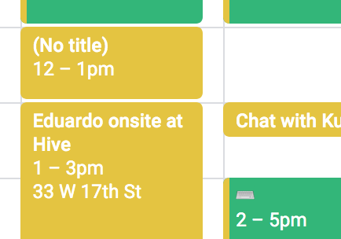
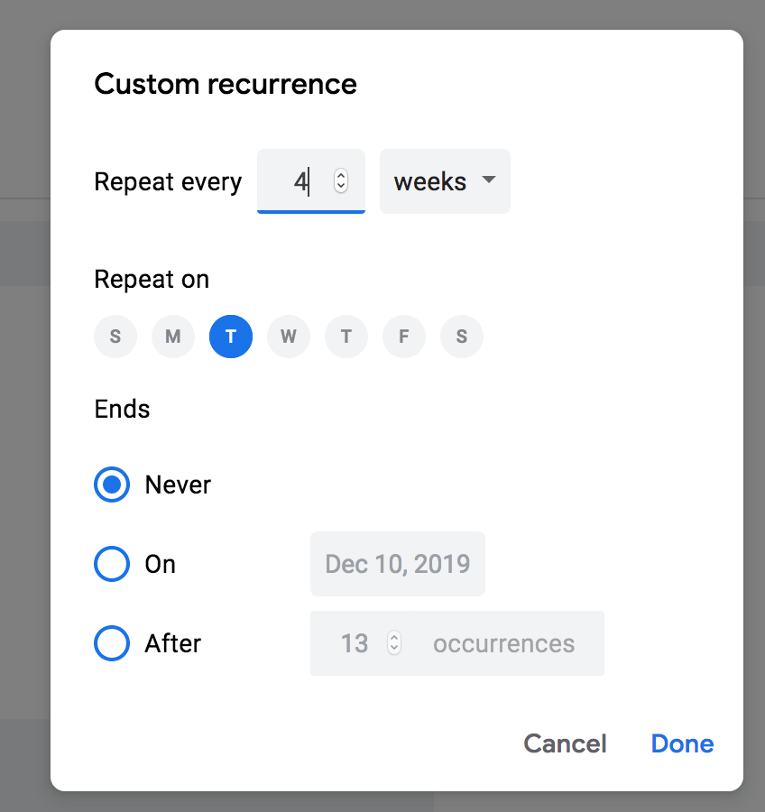

# Notes

### By Eduardo Medina

Started by getting things set up and attempting to replicate bugs. My first reaction was "the current state of the app is not great" indeed, it felt very buggy. Only three bugs are mentioned in the README but it felt like there were more bugs in there. For example why click outside of modal to create an event? More intuitive would be to have a create/save button or handling a press enter.

Codebase structure seems to make sense after the first glance at it. I noted the import and use of `moment`, this came in handy later. Also noted the https://fullcalendar.io/docs which turned out important to read to understand how the events were being created in the app. I started tackling the first bug.

---

## Bug #1 from README

```
## Updating an event, then opening modal causes event to reset in background

Steps to reproduce:

1. Click a date to create an event
2. Drag and drop the event to a new date
3. Click the event to open the modal

Expected: The event in the background shouldn't change dates
Actual: The event in the background briefly reverts back to the original date, but then fixes itself when you close the modal.
```

This is what saw on the console when replicating the first bug:

- On browser console

```
  Error: "Request failed with status code 500"
  createError createError.js:16
  settle settle.js:18
  handleLoad xhr.js:77
```

- On server console

```
  PUT /api/events/undefined 500 2.270 ms - 1405
  Error: Argument passed in must be a single String of 12 bytes or a string of 24 hex characters
```

So I started from there and followed the method flow order to understand how data is being passed around (`updateEventDates` is invoked by `onEventDrop` and `onEventResize`, wrong returned id always seems to be "\_fc2", etc). I wrote out what I saw as the logic order to create a new single event:

1. A click on a new day invokes `onDayClick` which initializes some variables and sets state for `newEvent` and `modelOpen: true`, so the modal opens
2. User inputs title, then click outside modal
3. `onCloseModal` has if/else logic: if `newEvent` is true, then hit the POST endpoint to create the event; else do a PUT. On the callback call once it returns from either case, update the `events` array accordingly and `setState`

We're saying the bug occurs with new events only, so when doing the post. Look at the post handler in the sever:

```
.post(async (req, res, next) => {
  try {
    const {
      mongo: { Events },
      body: { title, start, end },
    } = req;
    if (!title) throw new Error('Required field "title" missing.');
    if (!start) throw new Error('Required field "start" missing.');
    if (!end) throw new Error('Required field "end" missing.');
    // Create new event doc and respond with it to keep things snappy
    const newEventDoc = {
      title,
      start: new Date(start),
      end: new Date(end),
    };
    res.json(newEventDoc);
    await Events.insertOne(newEventDoc);
  } catch (e) {
    next(e);
  }
});
```

Indeed the issue is that response is being sent back before `await`ing for the database insert. Here are the logs:

- `await` after `res.json`

```
  onCloseModal() - newEvent - .post.then() - dataObject { title: "test11", start: "2019-09-24T00:00:00.000Z", end: "2019-09-24T23:59:59.000Z" }
```

- `await` before `res.json`

```
  onCloseModal() - newEvent - .post.then() - dataObject { title: "test12", start: "2019-09-25T00:00:00.000Z", end: "2019-09-25T23:59:59.000Z", \_id: "5d768a9f832ff56e40dba7df" }
```

If we await for the database insert as we should, the data comes back with `_id` as expected. This also explains why the bug would disappear on a specific event after a refresh, on that next state iteration the insert would have completed.

## Bug #2 from README

```
## Creating an event then opening it to edit goes weird

Steps to reproduce:

1. Click an empty date (modal for new event should show)
2. Enter a title
3. Click away to close the modal and save the event (works fine...)
4. Click to open the event again
5. Edit the title to something else
6. Click away to close the modal and save the event

Expected: New title saves
Actual: New title doesn't update, but if you refresh the page it works fine.
```

The cause of this bug is the same as the first bug: the `id` not being present on the client side beacuse the app wasn't `await`ing for database insert. After fixing the first bug, I couldn't replicate the second one anymore. To confirm, I reverted the last change (`res.json` before `await`) and indeed this bug number 2 came up again.

## Bug #3 from README

```
## Creating a new event with no title or updating an event to have no title throws an error!

This is a bad user experience! Let's fix or make it better!
```

The `title` variable is required on the server so the app throws as expected:

```
if (!title) throw new Error('Required field "title" missing.');
```

The right approach would be to validate data entry before invoking the API endpoint. I decided to go with "(No title)" mimicking Google Calendar's behavior.



---

## New feature: recurring events

```
## Basic specification

We need to support recurring events just like Google Calendar does.Let's add a checkbox to define an event as "recurring". If the checkbox is checked, show the user a UI component with the following options:

- A single select dropdown called "Interval" which has numbers 1-10
- A multi select dropdown called "Days to repeat" which has all 7 days in the week
- A date input called "Start date" - this is when the recurring series should begin
- A date input called "End date" - this is when the recurring series should end
```

I appreciated the suggestion in the README of getting started with a `getDates` method, it did help me start thinking about how to approach the feature and get things moving. I took a good amount of time here to dive into the https://fullcalendar.io/docs to understand the details regarding the events parsing.

Naturally I came across the built-in recurring events feature and it seemed very promising initially. However after reviewing it carefully I understood that adding an interval to the recurring event (as requested per feature specification) was not supported directly. I did some brainstorming: if somehow we wanted to use the recurring feature that fullCalendar provides, it seems like we'd have to touch a few different parts of the codebase, edit API endpoints, etc. That's not entirely awful but made me wonder that was making things more complicated than it needed to be, plus the fact that intervals are not supported out of the box. I wanted a less intrusive approach —a more tofu approach— and decided to go off the fact that the `events` array is what's serving as a source of truth for the calendar, and therefore I could repeat the same process of individual event creation with each one of the dates that `getDates` returns, using a `forEach` to handle the asynchronous process inside a loop.

I took the liberty of coding the UI inspired by Google Calendar's recurrent events.



The approach taken for this feature has its pros and cons. On one hand, it is a less intrusive method that can still use the same data model enabled by the API. Every recurring event gets inserted to the database as a series of individual events. On the other hand, it is limited in terms of possibly supporting recurring events which never end in the future. In that case, using a more robust library like rrule.js may be more favorable.

---

## Wrap up

As far as what else we can do to improve this app and some things left as TODOs:

- There are a few opportunities to refactor and modularize some parts of App.js
- Modal UI can be further improved:
  - Fix close out ("x") button
  - Add a save button and/or handle enter key press
- Add data validation for the `RecurringDetailsForm`
  - End data must be in the future of start date
  - If no days of the week are selected, handle with defaults
- Better error handling
- Add function comments to all App.js methods
- Could use some styling and CSS love

All in all, I enjoyed working on this app. I appreciated the README language which made it feel more real, as if I were jumping in to help a team mate. I'm looking forward to any feedback and would be happy to address any questions.
